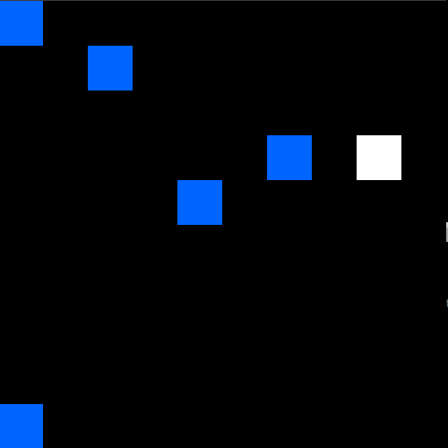

# Deep Reinforcement Learning for safety in robotics


[](https://travis-ci.com/ipa-mae-ma/safety)


## Architectures
### HRA
[Hybrid Reward Architecture](http://arxiv.org/abs/1706.04208)

Paper HRA architecture using Mnih architecutre from [Playing atari with deep reinforcement learning](https://arxiv.org/pdf/1312.5602.pdf).


Paper HRA solutio for the Fruit Game using a tabular representation.


### A3C
[Asynchronous Advantage Actor Critic](http://arxiv.org/abs/1602.01783) (A3C)



### DQN
[Deep Q-Networks](https://www.nature.com/articles/nature14236.pdf)


Paper DQN network architecture:


Simplified network architecture:


## Fruit Game
[Fruit game](https://github.com/Maluuba/hra) from Maluuba will be used to benchmark the different architectures.

### Reward
**Do only change the reward in the `fruit_collection.py` main class from which other packages inherit!**
Do **not** change the reward in `fruit_collection_train.py`, otherwise the learning will not converge.
Workings rewards:

| fruit | ghost | step | game mode | addition |
|:---:|:---:|:---:|:--:|:---:|
| +1.0  |  -    | 0.0  | mini | use normalization for frame input |
| +10.0| - | 0.0 | mini | no noramlization for frame input |
| +100.0| - | 0.0 | mini | no noramlization for frame input |

# TODO list

## CI
- [x] setup `travis` test for all architectures
  - [x] update `.travis.yml`
  - [x] `pytest`: easy to use

- [x] gym environments for architectures:
  - [x] frozen lake
  - [x] crawler


## Architectures
- define functions:
  - [x] `value iteration`
  - [x] `policy iteration`
  - [x] `q-learning`-function
  - [x] `deep q`-function
  - [x] `visualization`-function
    - `matplotlib`?

### DQN

- [x] simple DQN implementation
- [x] paper DQN implementation by 'Mnih'
- [x] use `pickle` to save weights
  - [x] include `overwrite` parameter
- [x] use `results` folder
- [x] implement `warmstart` functionality
- [x] flag for simple or complex DQN network

- hyper parameters:
  - learning rate
  - gamma
  - update frequenzy of target network
  - dense layers to use

## Interaction
all environment information from `fruit_collection_train.py`: API to interact with architectures.

## Structure
The `environment` folder contains the fruit-collection environment game. In `architectures` are the implementations of the chosen architectures stored as one module.
Folder `ci` stores the `test_integration.py` file which handles all the `pytest` tests to sustain maintainability.

```text
ci/
  ├── crawler_env.py
  ├── discrete_env.py
  ├── frozen_lake.py
  ├── function_test.py
  ├── gym_env_test.py
  └── __init__.py
architectures/
  ├── __init__.py
  ├── a3c.py
  ├── config_dqn.yaml
  ├── dqn.py
  ├── evaluation.py
  ├── hra.py
  ├── mdp.py
  ├── misc.py
  └── replay_buffer.py
environment/
  ├── fruit_collection_pictures.py
  ├── fruit_collection.py
  ├── fruit_collection_train.py
  ├── pictures/
  └── README.md
```
